# **RAG.WTF: A Private, Modular RAG Application**

  
  
  
  
  

**RAG.WTF** is a comprehensive, Flutter-based Retrieval-Augmented Generation (RAG) application built to be open-source, modular, and easy to deploy. It provides developers with full control over their data and infrastructure, demystifying the complexities of building RAG systems by offering a clear, feature-rich starting point.

 

A GIF demonstrating the full user flow: uploading a document, asking a question, and receiving a sourced answer would be ideal here.  
[Screenshot or GIF of the RAG.WTF App UI in Action]

## **📋 Table of Contents**

* [**Why RAG.WTF?**](#-why-ragwtf)  
* [**Key Features**](#-key-features)  
* [**Architectural Overview**](#-architectural-overview)  
* [**Project Structure**](#-project-structure)  
* [**Technologies Used**](#-technologies-used)  
* [**Getting Started**](#-getting-started)  
  * [Prerequisites](#prerequisites)  
  * [Choosing Your Setup](#choosing-your-setup)  
  * [Quick Start (Browser-Only)](#quick-start-browser-only)  
  * [Full Local Setup (with Ollama)](#full-local-setup-with-ollama)  
* [**Configuration**](#-configuration)  
  * [Environment Variables](#environment-variables)  
  * [LLM Provider Configuration](#llm-provider-configuration)  
  * [External Services](#external-services)  
  * [Firebase Setup](#firebase-setup)  
* [**Security Considerations**](#-security-considerations)  
* [**Scripts**](#-scripts)  
* [**Testing**](#-testing)  
* [**CI/CD & Deployment**](#-cicd--deployment)  
* [**Troubleshooting / FAQ**](#-troubleshooting--faq)  
* [**Roadmap**](#-roadmap)  
* [**Community & Showcase**](#-community--showcase)  
* [**Contributing**](#-contributing)  
* [**License**](#license)

## **⁉️ Why RAG.WTF?**

We named it **RAG.WTF** because we wanted to answer the question, "What's The File?" with unprecedented accuracy—and to make the setup process so simple you'll say, "Wow, That's Fast\!"

The primary goal of RAG.WTF is to provide a powerful, client-centric RAG solution. By leveraging SurrealDB's WebAssembly (WASM) capabilities, it can run entirely in the browser, offering significant benefits:

* 🔒 **Enhanced Data Privacy**: User data can remain on the client machine, never being sent to a server.  
* 💰 **Cost-Effective**: Reduces the need for server-side infrastructure, making it highly economical for personal use or prototyping.  
* 🌐 **Offline-First Potential**: Lays the groundwork for future offline capabilities.

## **✨ Key Features**

* 💻 **Client-Side RAG**: Runs entirely in the browser using SurrealDB WASM for a secure, serverless-optional experience.  
* 📦 **Modular Monorepo**: Built with Melos, the project separates concerns into distinct packages (chat, document, settings, etc.).  
* 🤖 **Multi-Provider LLM Support**: Comes pre-configured for various local and cloud-based LLM providers, including Ollama, OpenAI, Anthropic, Gemini, and more.  
* ⚙️ **Comprehensive RAG Settings**: A dedicated UI to configure every aspect of the RAG pipeline, from chunking and embedding to retrieval and generation parameters.  
* 🧱 **Clean State Management**: Utilizes the Stacked architecture with its ViewModel pattern for a clear separation between UI and business logic.  
* 🚀 **CI/CD Ready**: Includes GitHub Actions workflows for automated testing and deployment to Netlify.  
* 📱 **Cross-Platform**: Built with Flutter for seamless deployment across web, mobile, and desktop.

## **🏛️ Architectural Overview**

The application follows a standard RAG pipeline, orchestrated across its modular packages.

1. **Document Ingestion & Processing**: A user uploads a document through the UI (packages/document). The document is sent to an external text-splitting service, chunked, and then vector embeddings are generated for each chunk via the configured LLM provider.  
2. **Storage**: The text chunks and their corresponding vector embeddings are stored locally or remotely in SurrealDB (packages/database).  
3. **Retrieval & Generation**: When a user submits a query in the chat interface (packages/chat), the query is vectorized. A similarity search is performed against the stored vectors to find the most relevant document chunks. These chunks are then combined with the original query into a detailed prompt, which is sent to the LLM to generate a final, context-aware answer.

```mermaid
graph TD  
    subgraph "UI Layer (Flutter)"  
        A[📄 Document Upload UI] --> B{📄 Document Service};  
        C[💬 Chat UI] --> D{💬 Chat Service};  
    end

    subgraph "Core Logic (Dart Packages)"  
        B --> E[✂️ Splitting & Embedding];  
        E --> F{💾 Database Service};  
        D --> G[🔍 Query Vectorization];  
        G --> F;  
        F --> H[🔎 Similarity Search];  
        H --> I{📝 Prompt Construction};  
        I --> J{🧠 LLM Generation};  
    end

    subgraph "Backend & Services"  
        K[🗄️ SurrealDB]  
        L[🤖 LLM Provider API]  
        M[✂️ Text Splitting Service]  
    end

    B -- Sends File --> M;  
    F -- Stores/Retrieves Data --> K;  
    E -- Generates Embeddings --> L;  
    J -- Generates Response --> L;  
    J --> C;
```

## **🏗️ Project Structure**

The project is a Melos-managed monorepo. Key directories and files include:

├── .github/              \# CI/CD workflows (GitHub Actions, Netlify)  
├── packages/  
│   ├── analytics/        \# Event tracking (Mixpanel, Firebase)  
│   ├── chat/             \# Chat UI, state management, and RAG backend communication  
│   ├── console/          \# Console interface for direct system interaction  
│   ├── database/         \# SurrealDB connection management and models  
│   ├── document/         \# File uploads, chunking, and embedding logic  
│   ├── settings/         \# Management of LLM providers and RAG parameters  
│   └── ui/               \# Shared UI components and widgets  
├── scripts/              \# Utility scripts for building, generating code, etc.  
├── lib/                  \# Main application shell and bootstrapping logic  
├── firebase.json         \# Firebase configurations for dev, stg, and prod  
├── melos.yaml            \# Monorepo scripts and workspace definitions  
├── pubspec.yaml          \# Root project dependencies  

## **🛠️ Technologies Used**

* 🐦 **Framework**: Flutter  
* 🎯 **Language**: Dart (>=3.8.1 <4.0.0)  
* 📦 **Monorepo Management**: Melos  
* 🧱 **State Management**: Stacked  
* 🗄️ **Database**: SurrealDB (via surrealdb\_wasm)  
* 🔥 **Backend Services**: Firebase (for multi-environment config)  
* 🔄 **CI/CD**: GitHub Actions  
* 🌐 **Deployment**: Netlify

## **🚀 Getting Started**

### **Prerequisites**

* Flutter SDK  
* Dart SDK (>=3.8.1 <4.0.0)  
* Melos (dart pub global activate melos)  
* Docker (for the full local setup)

### **Choosing Your Setup**

| Setup Type | Use Case | Requirements | Data Privacy | Cost |
| :---- | :---- | :---- | :---- | :---- |
| 🌐 **Browser-Only** | Quick demos, testing UI, using with cloud LLMs. | Browser only. | Depends on cloud LLM provider. | Free (excluding API costs). |
| 💻 **Full Local** | Offline development, maximum data privacy, no API costs. | Docker, Ollama. | Maximum (data never leaves your machine). | Free. |

### **Quick Start (Browser-Only)**

This method runs the application using SurrealDB's in-browser storage (IndexedDB), requiring no external database or LLM setup.

1. **Clone and Bootstrap:**  
   git clone https://github.com/rag-wtf/app.git  
   cd rag  
   melos bootstrap

2. **Run the App:**  
   melos run

   The melos run command executes the Flutter application in development flavor, using configuration from .env.dev.

### **Full Local Setup (with Ollama)**

This setup provides a complete offline RAG experience using local models via Ollama and a local SurrealDB instance.

1. **Clone and Bootstrap** (if you haven't already).  
2. **Set up Ollama:**  
   * [Install Ollama](https://ollama.com).  
   * Pull the default models required by the application:  
     ollama pull llama3.2  
     ollama pull nomic-embed-text

3. **Start SurrealDB:**  
   melos start\_surreal

   This starts a local SurrealDB instance in a Docker container, with data persisted in \~/surrealdb\_data.  
4. **Configure Environment Variables:**  
   * Copy the example environment file: cp .env.example .env.dev  
   * The default values in .env.dev are pre-configured for this local setup. No changes are needed.  
5. **Run the App:**  
   melos run

## **🔧 Configuration**

### **Environment Variables**

Create .env.dev, .env.stg, and .env.prod files for each environment. Start by copying .env.example and filling in your details.

\# .env.example

\# Analytics (Optional)  
MIXPANEL\_PROJECT\_TOKEN=your\_mixpanel\_token

\# RAG Services URLs (Default values are for the local Ollama setup)  
SPLIT\_API\_URL=http://localhost:8000/split  
EMBEDDINGS\_API\_URL=http://localhost:11434/v1/embeddings  
GENERATION\_API\_URL=http://localhost:11434/v1/chat/completions

### **LLM Provider Configuration**

The application's settings UI is dynamically populated from packages/settings/assets/json/llm\_providers.json. You can add, remove, or modify LLM providers and their default models in this file.

// Example from packages/settings/assets/json/llm\_providers.json  
{  
  "id": "ollama",  
  "name": "Ollama",  
  "base\_url": "http://localhost:11434/v1",  
  "website": "https://ollama.com",  
  "embeddings": {  
    "model": "nomic-embed-text",  
    // ... other embedding models  
  },  
  "chat\_completions": {  
    "model": "llama3.2",  
    // ... other chat models  
  }  
}

### **External Services**

**Text Splitting Service** The application relies on an external API endpoint for text splitting, defined by SPLIT\_API\_URL. The source code for this service is available at [github.com/rag-wtf/split](https://github.com/rag-wtf/split). You must run this service locally or deploy it for the document processing to work.

### **Firebase Setup**

The project uses Firebase for environment separation. To configure your own Firebase projects, run the configuration script for each environment:

./flutterfire-config.sh <environment>

Replace <environment> with dev, stg, or prod.

## **🛡️ Security Considerations**

* **SurrealDB**: For production deployments, ensure your SurrealDB instance is secured with strong root credentials and appropriate network rules to restrict access.  
* **API Keys**: Never hardcode API keys. Use environment variables (.env files) or a secure secrets management solution.  
* **Input Sanitization**: Be mindful of prompt injection risks. While this is a demo application, production systems should implement robust input sanitization and validation.

## **📜 Scripts**

Key scripts are defined in melos.yaml and can be run with melos <script\_name>:

| Script | Description |
| :---- | :---- |
| run | ▶️ Runs the app in development flavor using .env.dev. |
| bootstrap | 📥 Installs all dependencies across the monorepo. |
| generate / generate\_packages | ⚙️ Runs build\_runner for code generation across the project. |
| test | ✅ Runs all unit and widget tests for all packages. |
| local\_integration\_test | 🧪 Runs integration tests locally using Docker and Chrome. |
| start\_surreal | 🗄️ Starts a local SurrealDB instance via Docker. |
| build\_prod | 📦 Builds the web app for production. |

## **🧪 Testing**

The project includes a full suite of tests. Run all unit and widget tests with:

melos test

For end-to-end testing, run the local integration tests:

melos local\_integration\_test

## **🔄 CI/CD & Deployment**

The CI/CD pipeline is managed by GitHub Actions:

* **main.yaml**: Validates pull requests with spell checks, analysis, and build tests.  
* **netlify.yaml**: Deploys the main branch to Netlify. The workflow automatically runs the full integration test suite before building and deploying the web application, ensuring the stability of the production release.

For a self-hosted production deployment, you can deploy the production web build (melos build\_prod) to any static host and run a production instance of SurrealDB using Docker on your server. Ensure all environment variables in your .env.prod file point to your production services.

## **❓ Troubleshooting / FAQ**

* **Melos command fails**: Ensure you have activated Melos globally (dart pub global activate melos) and that your Dart SDK's bin directory is in your system's PATH.  
* **App fails to connect to SurrealDB**: Make sure the Docker container is running (docker ps) and that there are no port conflicts on your machine.  
* **Errors during code generation**: Try cleaning the project with melos clean and then re-running melos bootstrap and melos generate.  
* **CORS errors in browser**: When connecting the web app to a local service like Ollama, you may encounter CORS errors. You need to configure Ollama to accept requests from the web app's origin. Refer to the Ollama documentation for instructions on setting the OLLAMA\_ORIGINS environment variable.

## **🗺️ Roadmap**

* [ ] Support for additional LLM providers.  
* [ ] Advanced document processing features (e.g., image and table extraction).  
* [ ] Enhanced UI/UX for a more intuitive user experience.  
* [ ] Caching mechanisms to improve performance and reduce API costs.

## **🌟 Community & Showcase**

Have you built something cool with RAG.WTF? We'd love to see it\! Please submit a pull request to add your project to a community showcase list here.

## **🤝 Contributing**

Contributions are welcome\! We use a fork-and-pull-request workflow. Please see the CONTRIBUTING.md file for detailed instructions on how to set up your development environment and contribute to the project.

We use GitHub Issue Templates for bug reports and feature requests. Please use them to provide clear and actionable information.

## **License**

This project is licensed under the MIT License. See the [LICENSE](https://www.google.com/search?q=LICENSE) file for details.